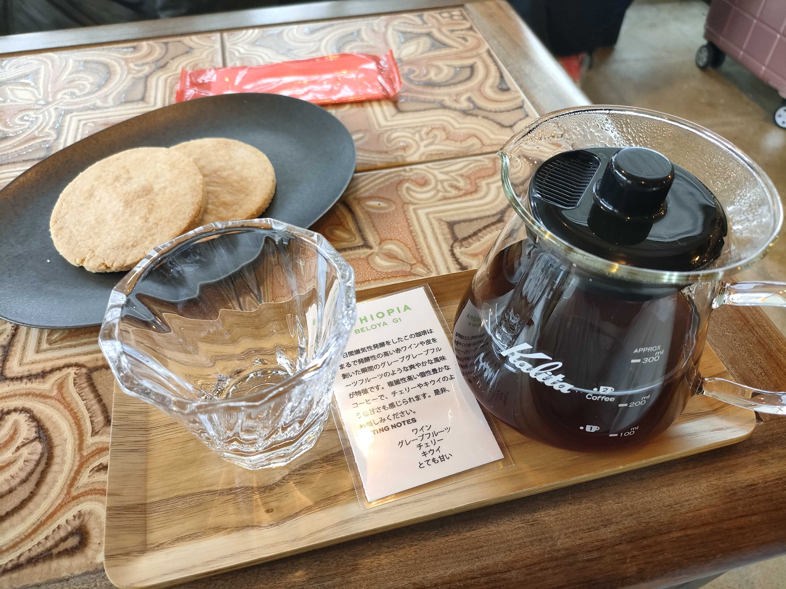
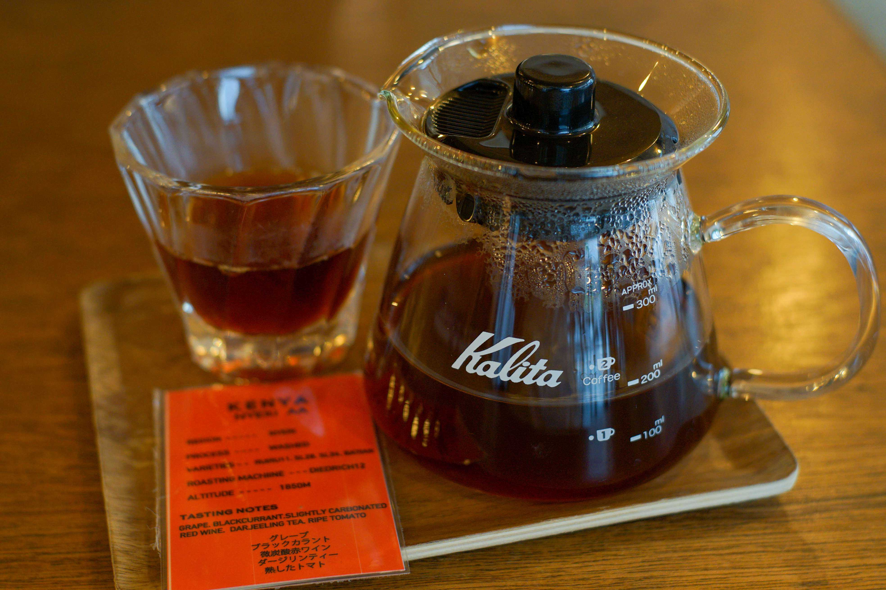
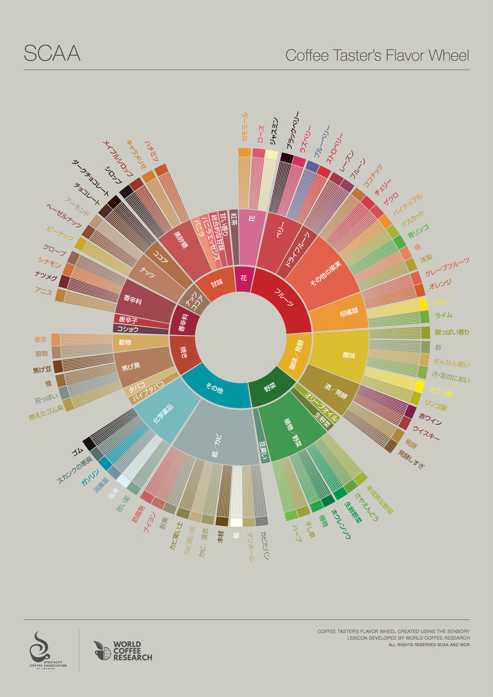
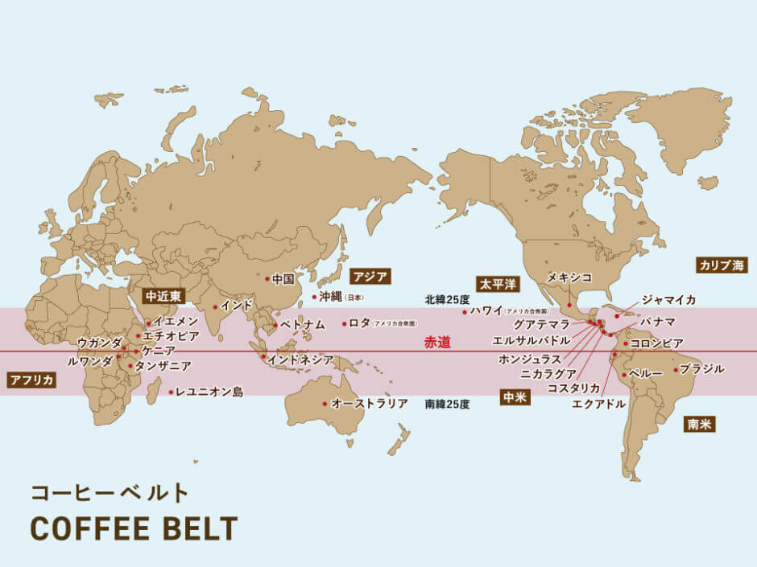

# ☕️ エンジニアが

# コーヒーを趣味にするべき理由 n 選

haruone

---

## ☀️ はじめに

みなさん、コーヒー飲んでますよね？

でも、「ただ飲むだけ」になっていませんか？

---

## 💡 今日の話

コーヒーを “趣味” にすることで  
毎日の中にちょっとした楽しみが増える  
そんなお話をします ☕

---

## ☕️ 理由 ①

### 日常がちょっと特別になる

朝の一杯を「なんとなく飲む」から  
「今日はどんな味にしよう？」に変わる。

たったそれだけで、  
一日の始まりが少し楽しくなります。

---

## 🌱 コーヒーには個性がある

同じ「コーヒー」でも、  
豆の種類・産地・焙煎度・淹れ方で  
まるで別の飲み物になります。

> フルーティな酸味、ナッツの香ばしさ、  
> チョコのような甘み…  
> いろんな表情を見せてくれます。

---

## ☕️ 理由 ②

### 始めるハードルがとても低い！

最初は **ドリップバッグ** で OK です。  
お湯を注ぐだけで、香りも味も驚くほど豊か。

「今日は浅煎り」「今日は深煎り」  
そんな風に飲み比べるだけでも十分楽しい。

---

## ☕️ 自分で淹れてみたくなったら

そのときに、少しずつ道具を揃えてみましょう。

| 道具         | ポイント                        |
| ------------ | ------------------------------- |
| グラインダー | 豆を挽くと香りが格段に良くなる  |
| ドリッパー   | 手軽に始められる（百均でも OK） |
| ケトル       | 細く注げるタイプが便利          |
| スケール     | 毎回同じ味で淹れられる          |

---

## 🧰 ステップアップの楽しみ

> 最初は「飲むだけ」  
> → 次は「自分で淹れる」  
> → そして「好みの味を探す」

ゆっくりステップを踏むのが、  
コーヒー趣味のいちばん楽しいところです。

---

<!-- _class: split -->

## ☕️ 理由 ③

### 味の違いを感じるのが楽しい

たまたま入ったお店で飲んだ**エチオピアのアナエロビック**

赤ワインやいちご、いちじくのような風味がして、  
「これ、本当にコーヒー！？」と感動しました。

---

<!-- _class: split -->

### 味の違いを感じるのが楽しい

他にも、例えばケニアのコーヒーはトマトジュースのような後味が感じられて、同じコーヒーでも本当に幅広い味を感じられてめちゃくちゃ面白いです

---

## 🌈 味わいを見つける旅

最初はいろんな焙煎度や産地を飲み比べてみよう。

・浅煎り → フルーティで爽やか  
・中煎り → バランスが良い  
・深煎り → コクと苦味がしっかり

自分の「好きな味」に出会うのが楽しい時間です。

---

## 🌾 「精製方法」でも味が変わる

コーヒー豆は、収穫した後の果実の処理方法（精製）によっても  
風味がまったく変わります。

| 精製方法                        | 特徴                             |
| ------------------------------- | -------------------------------- |
| **ウォッシュト（Washed）**      | すっきり・クリーンな味わい       |
| **ナチュラル（Natural）**       | 果実感が強く、甘みが豊か         |
| **ハニー（Honey）**             | 両者の中間。まろやかで優しい甘さ |
| **アナエロビック（Anaerobic）** | 発酵由来のワインのような香り     |

---

## 🍇 同じ豆でも、精製でここまで変わる！

例えば「エチオピア」の豆でも…

- ウォッシュト：ジャスミンやレモンのように爽やか
- ナチュラル：ブルーベリーやいちごのように甘い
- アナエロビック：まるで赤ワインのような芳醇さ

> “どう作られたか” に目を向けると、  
> コーヒーの世界が一気に広がります。

---

<!-- _class: split -->

## 🔍 慣れてきたら少し探求

「アロマホイール」という  
香りの分類表を見ながら飲むと、  
香りや味の表現がどんどん広がります。

> 「今日はナッツっぽいな」  
> 「ベリーの香りがするかも」  
> …そんな風に感じられると、世界が変わります。

---

## ☕️ 理由 ④

### ペアリングでさらに楽しく

.jpg>)

コーヒーはスイーツとの相性も抜群。

- 深煎り × チョコレート
- 中煎り × チーズケーキ
- 浅煎り × フルーツタルト

組み合わせを考えるのもワクワクします。

---

<!-- _class: split -->

## 🌍 世界中のいろいろなコーヒー

| 産地         | 特徴                     |
| ------------ | ------------------------ |
| エチオピア   | 華やかでフルーティ       |
| ケニア       | ジューシーで明るい酸味   |
| コロンビア   | バランスが良く飲みやすい |
| インドネシア | スパイシーで重厚         |

---

## ⚗️ 実践してみよう！

1. 豆を 15g 用意
2. お湯を 90℃ に沸かす
3. 45ml 注いで 40 秒蒸らす
4. 45ml ずつ、合計 225ml まで注ぐ
5. 3 分 30 秒で抽出完了

> https://www.youtube.com/watch?v=lJNPp-onikk
> 【教科書】世界を獲った伝説のコーヒードリップレシピ 🏆 ４：６メソッドの全てをお伝えします！

---

## 🧠 コーヒーを趣味にすることで

- 日常の中に小さな楽しみが生まれる
- 自分の「好き」がはっきりしてくる
- 朝が少し楽しみになる ☀️

---

## 🚀 まとめ

| 理由 | 内容                                         |
| ---- | -------------------------------------------- |
| ①    | 日常がちょっと特別になる                     |
| ②    | 手軽に始められる（まずはドリップバッグから） |
| ③    | 味の違いを楽しめる                           |
| ④    | ペアリングが面白い                           |

---

# ☕️ ありがとうございました！
